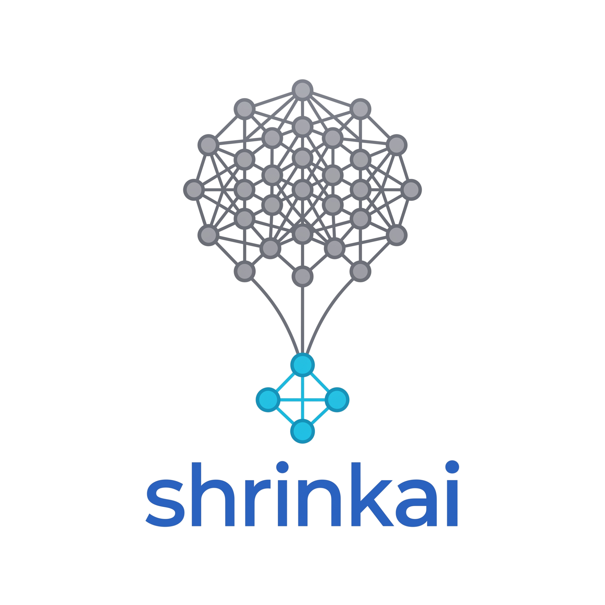

# **Welcome to ShrinkAI's documentation**

<div style="display: flex; gap: 2.5rem; align-items: flex-start; margin-bottom: 2rem; flex-wrap: wrap;">

  <div style="flex: 0 0 200px; display: flex; flex-direction: column; align-items: center; text-align: center;">
    
    <div style="display: flex; flex-direction: column; gap: 0.4rem; align-items: center;">
      <a href="https://pypi.org/project/shrinkai/">
        
      </a>
      
      <a href="https://github.com/elouanzer/shrinkai">
        
      </a>
      
    </div>
  </div>

  <div style="flex: 1; min-width: 280px;">
    <div class="md-typeset" style="flex: 1; min-width: 320px;">
    <p>
      <strong>ShrinkAI</strong> is a package for reducing neural networks size, making them ideal to run on small devices such as smartphones or robots, and for speeding up inference, particularly interesting for edge AI.
    </p>
    <p>
      This package includes, among other things, numerous distillation and compression techniques, all wrapped in an API that is easy to use for users familiar with PyTorch. It also provides customizable training loops and easy export features.
    </p>
  </div>
  </div>
</div>


## **Installation**

ShrinkAI is on pypi and can be installed with the following command:
```bash
pip install shrinkai
```

The package is compatible with Python 3.11+, and depends on `torch`, `torchvision`, `rich`, `tqdm`, and `psutil`. Exporting to ONNX additionally requires the `export` extra: `pip install shrinkai[export]`.

## **Contact & Contributing**

You can report an [issue](https://github.com/elouanzer/shrinkai/issues) directly on GitHub. Bug reports, feature requests, and questions are all welcome.

Contributions are welcome too, whether it's a bug fix, a new feature, or a documentation improvement:

1. Open an issue first for anything non-trivial, to discuss the approach before you start.
2. Fork the repository and work on a dedicated branch.
3. Add or update tests for any behavior change (run `uv run pytest` locally before opening a PR).
4. Keep the code clean: `uv run ruff check` and `uv run ruff format`.
5. Open a pull request against `main`, CI runs the test suite, coverage, and lint checks automatically.

## **Citation**

If you use ShrinkAI in your work and think it was helpful, please cite it as:

```bibtex
@software{shrinkai2026,
  author  = {Elouan Marsot},
  title   = {ShrinkAI},
  url     = {https://github.com/elouanzer/shrinkai},
  license = {MIT},
  version = {0.1.0}
}
```

## **License**

[MIT License](https://github.com/elouanzer/shrinkai/blob/main/LICENSE)